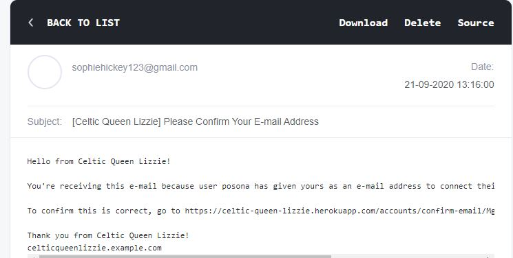

# LIZ HICKEY LIFEDIGN

LIFEDESIGN was created by Liz which is a process that helps people to overcome different life challenges. It will give you tools to be able to move forward from all kind of experiences and to find creative and innovative solutions to your problems.

# Table of Contents:
* [UX](https://github.com/SophieH93/lizHickeyLifeDesign#ux)    
    * Project Goals
    * User Stories
    * User Goals
* [Strategy](https://github.com/SophieH93/lizHickeyLifeDesign#strategy)
* [Scope](https://github.com/SophieH93/lizHickeyLifeDesign#scope)
* [Structure](https://github.com/SophieH93/lizHickeyLifeDesign#structure)
* [Surface](https://github.com/SophieH93/lizHickeyLifeDesign#surface)
    * Design Choices
        * Typography
        * Colours
        * Styling
        * Images
    * [Feautres](https://github.com/SophieH93/lizHickeyLifeDesign#features)
* [Skeleton](https://github.com/SophieH93/lizHickeyLifeDesign#skeleton)
    * Wireframes    
        * Website Layout
        * Flowchart
* [Information Architecture](https://github.com/SophieH93/lizHickeyLifeDesign#information-architecture)
    * [Database Choice](https://github.com/SophieH93/lizHickeyLifeDesign#database-choice)
    * [Data Models](https://github.com/SophieH93/lizHickeyLifeDesign#data-models)
        * [Profile](https://github.com/SophieH93/lizHickeyLifeDesign#profile)
        * [Authentication](https://github.com/SophieH93/lizHickeyLifeDesign#user-loginregistercontact)
        * [Course](https://github.com/SophieH93/lizHickeyLifeDesign#course)
        * [Order](https://github.com/SophieH93/lizHickeyLifeDesign#order)
        * [Order Item Detail](https://github.com/SophieH93/lizHickeyLifeDesign#order-item-detail)
        * [Review](https://github.com/SophieH93/lizHickeyLifeDesign#reviews)
        * [Blog](https://github.com/SophieH93/lizHickeyLifeDesign#blog)

* [Technologies Used](https://github.com/SophieH93/lizHickeyLifeDesign#technologies-used)
    * [Languages](https://github.com/SophieH93/lizHickeyLifeDesign#languages)
    * [Frameworks](https://github.com/SophieH93/lizHickeyLifeDesign#frameworks)
    * [Tools](https://github.com/SophieH93/lizHickeyLifeDesign#tools)
    * [Databases](https://github.com/SophieH93/lizHickeyLifeDesign#databases)
* [Testing](https://github.com/SophieH93/lizHickeyLifeDesign#testing)
    * [Navbar/Footer](https://github.com/SophieH93/lizHickeyLifeDesign#navbarfooter)
    * [Authentication Pages:](https://github.com/SophieH93/lizHickeyLifeDesign#authentication-pages)
    * [Courses & Courses detail Page:
](https://github.com/SophieH93/lizHickeyLifeDesign#courses--courses-detail-page)
* [Shopping Cart Page:
](https://github.com/SophieH93/lizHickeyLifeDesign#shopping-cart-page)
* [Checkout](https://github.com/SophieH93/lizHickeyLifeDesign#checkout)
* [Bugs](https://github.com/SophieH93/lizHickeyLifeDesign#bugs)
* [Deployment](https://github.com/SophieH93/lizHickeyLifeDesign#deployment)
    *  [Locally run the project](https://github.com/SophieH93/lizHickeyLifeDesign#run-locally)
    * [Deploying to Heroku](https://github.com/SophieH93/lizHickeyLifeDesign#deploy-to-heroku)
* [Credits](https://github.com/SophieH93/lizHickeyLifeDesign#credits)
* [Disclaimer](https://github.com/SophieH93/lizHickeyLifeDesign#disclaimer)


# UX

## Project Goals


## User Stories
* As a user, I would expect the website to be secure.
* As a user, I would expect the website to be responsive on different devices.
* As a user I would expect to be able to view the courses offered.
* As a user I would expect there to be information on the business.
* As a user I would expect there to be information on the business owner.
* As a user, I would expect the website to have a contact page and links to social media.
* As a user, I would expect to be able make online payments.
* As a user, I would expect to receive details about my order.
* As a user, I would expect to see the location of the company on a map.
* As a user, I would expect there to be a booking system with a calender to pick an available day and time for a consultation.
* As a user, I would expect to be able to view and modify my order in the cart before completing it.
* As a user, I would expect to be able to view a total price of my purchases.
* As a user, I want to create my own account, so that I can save, view and edit my profile details and view my order history.
* As a user, I would expect to view reviews other customers.


## User Goals
* Catch attention by looking interesting.
* Easy to navigate through and understand what LIFEDESIGN is.
* Easy to buy.
* Option to book a free session and connect through social media to get to know the owner better.
* Colours to attract a female audience/potential client.
* The Website will ensure safe storage of user details.
* Purchase courses/services shown on the website in a safe and secure way.

## Owner Goals
* Visually appealing with brand logo included.
* Some animation to create interest.
* Easy to navigate.
* Easy to add new information as the business begins to grow.
* Facility for users to interact with the website e.g leave a review.
* Ability for users to book a free consultation.
* Instagram feed included on the website to bring colour and interest.
* Website to be easy to ready and understand.
* Suitable for an international English speaking audience. 

# Strategy:

The goal of this website is to provide users with a background to the Service offered by Liz with a user-friendly design.
The users have the option to book a session with Liz directly, purchase a Course available and contact Liz via a contact form or through Liz's Social Media Sites.

Target Audience - Female audience between the age of 36-65.


# Scope:
The website is easy to navigate through and contains simple animation for added effect w

# Structure:

* **Header:** 
The header contains the logo, brand name and some brand text and the navigation links. 
If the user is **logged in** to the website they will be able to purchase a course and leave a review.   
For a **superuser**, when they log in there will be a product management navigation link where they can upload a new course. They will also be able to edit and delete a course if required.

* **Home Page:**
The home page consists of scroll animation, information about the brand and a Instagram widget.

* **Login Page:**
Contains a **form** for the user to enter their **Username & Password** allowing them to log into their account, providing their details are corrent.   
If the details match the ones in the database, the user is redirected to the home pages and informed with a message that they have successfully logged in.

* **Register Page:**
Contains a form where the user enters a Username, Password and Confirm Password field. The Passwords must match and are hashed for security purposes.

* **About Page:** Contains background about Liz and her experience.

* **Courses Page:**  Contains the current courses offered by Liz that is stored in a database.

* **Course Page:** Contains information about the selected course, the **price** of the course, **quantity** option and two **buttons** - courses and add to cart.
The page also consists of a **review form** where logged in user can leave a review and will be stored in the database.

* **Testimonials Page:** Contains testimonials provided by Liz's clients and a **google map api** to show Liz's clients/followers around the world.

* **Book Page:** Contains information about a **book** Liz **co-authored** with a group of international women. and a link to Amazon to purchase the book.

* **Blog:** Contains a few blogs written by Liz that are stored in a database.

* **Contact:** Contains a contact form for a user to email Liz about an enquiry.


# Surface:
## Design Choice

**Typography-** [Baskervville](https://fonts.google.com/specimen/Baskervville?query=bask) for the brand name and [Lato](https://fonts.google.com/specimen/Lato?query=lato) for the body, which was both embedded from [Google Fonts](https://fonts.google.com/).

**Colours-** The color for the site is very simple as Liz wanted to use **Joule colours** - purple and green. 


**Animations:** I used two tyes of animations on this website, one for scrolling on a page and the other as an anchor as some pages do not require the user to scroll. I used [AOS-Animate on scroll](https://github.com/michalsnik/aos) which is used on the home and testimonials pages and [Animate.css](https://animate.style/).

**Images-**
The images chosen for the website were taking from [Unsplash](https://unsplash.com/) and provided by Liz.

## Features
* [Bootstrap](https://getbootstrap.com/docs/4.3/getting-started/introduction/)
* [AOS](https://github.com/michalsnik/aos)
* [Animate.css](https://animate.style/)
* [Google Maps API](https://developers.google.com/maps/documentation/javascript/overview)
* [Stripe](http://stripe.com/)
* [Gmail](https://gmail.com/)
* [Elfsight](https://apps.elfsight.com/)
* [Postgres](https://www.postgresql.org/)


## Future Features

# Skeleton:
## Wireframes

* [Desktop](https://github.com/SophieH93/lizHickeyLifeDesign/tree/master/wireframes/desktop)
* [Mobile](https://github.com/SophieH93/lizHickeyLifeDesign/tree/master/wireframes/mobile)
* Tablet

# Information Architecture:
## Database choice
During the development phase I worked with **[sqlite3](https://docs.djangoproject.com/en/3.1/ref/databases/#sqlite-notes)** database which is installed with Django.
For deployment(production), a **[PostgreSQL](https://docs.djangoproject.com/en/3.1/ref/databases/#postgresql-notes)** database is provided by Heroku as an add-on.

## Data Models
The **User Model** usied in this project is provided by Django as a part of defaults **django.contrib.auth.models**.
Click [here](https://docs.djangoproject.com/en/3.0/ref/contrib/auth/) to read more information about Django’s authentication system.

### **Profile**     


| Name        | Field Type           | Validaion  |
| ------------- |:-------------:| -----:|
|  user      | OneToOneField | User, on_delete=models.CASCADE |
| Phone Number    | CharField      |  max_length=20, null=True, blank=True  |
| Address Line1 |  CharField  |   max_length=80, null=True, blank=True |
| Address Line |  CharField   |   max_length=800, null=True, blank=True  |
| Town/City |   CharField   |  max_length=40, null=True, blank=True   |
| County |  CharField  |  max_length=80, null=True, blank=True   |
| Postcode |  CharField   |  max_length=20, blank=True   |
| Country |  CountryField    |  blank_label='Country ', null=True, blank=True |


### **Course**   


| Name        | Field Type           | Validaion  |
| ------------- |:-------------:| -----:|
|  excerpt    | TextField | max_length=30, default='some string'|
|  name   | CharField | max_length=254|
| description      | TextField      | 
| image_url | URLField     |   max_length=1024, null=True, blank=True|
| image | ImageField     |   null=True, blank=True|
| price     | DecimalField | max_digits=6, decimal_places=2 | 


### **Order**   
The Order model within the checkout app holds the following data for the orders.


| Name        | Field Type           | Validaion  |
| ------------- |:-------------:| -----:|
|   order_number  | CharField | max_length=32, null=False, editable=False|
|   User    | ForeignKey | UserProfile, on_delete=models.SET_NULL, null=False, blank=False, related_name='orders' |
|  Full Name   | CharField | max_length=50, null=False, blank=False |
| Phone Number    | CharField      |  max_length=20, null=True, blank=True  |
| email      | EmailField      |  max_length=254, null=False, blank=False|
| Address Line1 |  CharField  |   max_length=80,null=False, blank=False |
| Address Line |  CharField   |   max_length=80, null=False, blank=False |
| Town/City |   CharField   |  max_length=40, null=False, blank=False   |
| Postcode |  CharField   |  max_length=20, blank=True,  null=True,  |
| Country |  CountryField    |  blank_label='Country *', null=False, blank=False |
| county  |  CountryField    |  max_length=80, null=True, blank=True|
| purchase_date |  DateTimeField    |  auto_now_add=True |
| order_total |  DecimalField    | max_digits=10, decimal_places=2, null=False, default=0 |
| original_cart |  TextField    | ld(null=False, blank=False, default=''|
| stripe_pid|  CharField    | max_length=254, null=False, blank=False, default=''|


### **Order Item Detail**   
A row of Order Item Detail is created for each item existing in the shopping bag which then gets saved with the order.


| Name        | Field Type           | Validaion  |
| ------------- |:-------------:| -----:|
|  Order   | ForeignKey |Order, null=False, blank=False, on_delete=models.CASCADE, related_name='orderitems'|
|  Course  | ForeignKey | Course, null=False, blank=False, on_delete=models.CASCADE |
| quantity |  IntegerField    |  null=False, blank=False, default=0|
| Total Price |  DecimalField    | maax_digits=6, decimal_places=2,null=False, blank=False, editable=False,  default=0|
| datetime  |  CharField    |  null=True, blank=True, max_length=20|


### **Reviews**   


| Name        | Field Type           | Validaion  |
| ------------- |:-------------:| -----:|
|   User   | ForeignKey | User, on_delete=models.CASCADE'|
|  course   | ForeignKey | Course, on_delete=models.CASCADE|
| Review  |  TextField    |  null=False, blank=False, default=''|
| rate  |  IntegerField    |  choices=RATING_CHOICES, default=0|


### **Blog**   


| Name        | Field Type           | Validaion  |
| ------------- |:-------------:| -----:|
|  Title   | CharField | max_length=250 |
|  slug  | SlugField | max_length=250, unique_for_date='publish'|
| publish |  DateTimeField    | default=timezone.now|
| author |  ForeignKey    | User, on_delete=models.CASCADE, related_name='blog_posts'|
| content |  TextField    |  
| image_url |  URLField    |  max_length=1024, null=True, blank=True|
| status |  CharField    |  max_length=10,  choices=options, default='draft'|


# Technologies Used:
## Languages
* [HTML](https://developer.mozilla.org/en-US/docs/Web/HTML)
* [CSS](https://developer.mozilla.org/en-US/docs/Web/CSS)
* [JavaScript](https://www.javascript.com/)
* [Python](https://www.python.org/)

## Frameworks
* [Bootstrap](https://getbootstrap.com/docs/4.3/getting-started/introduction/)
* [Jinja](https://jinja.palletsprojects.com/en/2.11.x/)
* [Django](https://www.djangoproject.com/)


## Tools
* [GitHub](https://github.com/)
* [GitPod](https://www.gitpod.io/)
* [Git](https://git-scm.com/about)
* [W3C Markup Validation](https://validator.w3.org/)
* [WSC CSS Validaion](https://jigsaw.w3.org/css-validator/)
* [Python Formatter](https://pythoniter.appspot.com/)
* [Heroku](https://dashboard.heroku.com/apps)
* [Stripe](https://stripe.com/gb)
* [Django Secret Key Generator ](https://miniwebtool.com/django-secret-key-generator/)
* [Google Maps JavaScript API](https://developers.google.com/maps/documentation/javascript/overview)
* [Whitenoise](https://devcenter.heroku.com/articles/django-assets)

## Databases
* [PostgreSQL](https://www.postgresql.org/) - Production database
* [SQlite3](https://www.sqlite.org/index.html) - Development database

# Testing:

## Navbar/Footer:
* **Plan-**  I will need to ensure all the links work properly so when the user clicks on one they are brought to the correct page. To ensure the navbar will collapse and the side bar shows up when the hamburger menu is clicked.

* **Implementation-** 

* **Testing-** 

* **Result-** 


## Authentication Pages:
* **Plan-**  I will need to implement a way that a user will be able to create an account and that their information is stored in a database, to log in and logout.   
This invloves checking that the users passwords match when they create a password and confirm the password and their details are correct when they go to login.


* **Implementation-** I will use Django allauth package to create Authentication for the Register and Login Pages.   
I will create several sample accounts to test that validation works by entering two different passwords in registration form,   
creating an account and try to login with correct and incorrect details.
If the customer wishes to log out of their account I will need to ensure the logout link works.

* **Testing-** I used [Temp Mail](https://temp-mail.org/en/view/1a5285c005d2a6b0baf4c354391c4d6e) to create a temporary email and used my **Gmail** account to send real emails with Django. When the user register's on the website, an email will be sent to them asking them to verify their email. Once the user verifies their email they are able to log into the website.  
When verification link is clicked in the email, user is redirected to the confirmation page, clicking "Confirm" button, success message is displayed and user is automatically logged in


* **Result-**  Test passed. All the functionality works as expected, no bugs were found during the testing.


## Courses & Courses detail Page:
* **Plan-** I will need to ensure that all the following work:
    * I will need to ensure that if a user clicks on the **"View Details"** button or the image of a specific course that they are brought to the correct details of that course.  
    * The course description appers in the detail page.    
    * Login with **superuser** credentials and verify that the **Edit/Delete buttons appear** in both courses and course details pages under the image.
    * The **"Add to Cart" button** on the course details pages works.
    * The quantity range button works and calculate the total correctly.
    
* **Implementation-** I will setup the **course model** and **migrate** the table into the database, then create the view within the courses app that sends a GET request to the database and returns all the courses into the courses variable, making this available to the front end via the context in the return statement meant that I could loop through each course from the database and render the details using Djangos template language in the HTML.

* **Testing-** All courses within the database were correctly rendered to the courses.html page and course detail page.

* **Result-** Test **passed**. All the functionality works as expected, no bugs were found during the testing.

## Shopping Cart Page:
* **Plan-**    I will need to ensure that all the following work:
    * I will need to ensure that all the revelevent **buttons** work properly e.g courses and checkout'.     
    * I will need to ensure that if a user wishes to **proceed to the checkout** that they are brought to the **Login page** to create an account first before proceeding to the checkout page.   
    * I will need to ensure that if the user clicks on the cart without adding a course that the relevent message is displayed to advise the customer there is currently no items in the cart.
    * I will need to ensure that when the user clicks the cart, that the correct **course information is displayed**.
    * I will need to ensure the user can **remove** the **course** from the cart.

* **Implementation-** I build a **context** file within the cart app and include this within the context processors section within templates in the settings file, this is to tell the app what the cart should look like by default and what information should be available to it. This is also required as the cart is not stored in the database, but rather in the **session**. I was able to create function in the views flie for adding a course to the shoppping cart.

* **Testing-** To test these cart features I had to do the following:
    * Added a course to the shopping cart.
    * Clicked on the cart and make sure the shopping cart template displays with the course added.
    * Clicked the course button and see if it returns to the course page.
    * Clicked on the checkout page to see if works.
    * Clicked ok the remove item link to see if the course gets deleted from the shopping cart.

* **Result-** Tests passed based on the above criteria and information.


## Checkout:
* **Plan-** I will need to create a **checkout form** and a secure **payment system**, a **confirmation email** of their order sent to the user and an **order summary**.
    
* **Implementation-** I followed the material provide by Code Instutute. I used [Stripe](https://stripe.com/en-ie)  as the payment processor.  I created the **Order** and **OrderItem models** in the checkout app and peformed the migrations to setup the tables in the database. Then I create the form and views required and set up **Stripe validation** in a js file.
I also want to ensure that the user is redirected to the **login/register** page **before** they can proceed to **checkout**.


* **Testing-** To test these cart features I had to do the following:
    * Checked that **non-logged** in users are **redirected** to the **login page first** before they can proceed with their payment and that logged in users are bought straight to the checkout page.
    * On the **checkout page**, verified the image and text was displayed correctly (**order summary**).
    * Verified the form **validation** works by inputting incorrect details and trying to submit a empty field.
    * Verified the **Payment** section enter the testing **4242 4242 4242 4242** card number, any expiration date in future and any CVC, and then click on the "Complete Order" button (this was also checked on Stripe Dashbord to see if the order was created).
    * Once payment is completed, ensured the order summary was displayed.
    * Once payment is **complete**, checked the **Stripe Dashboard** and also Order model in **Admin** panel to make sure the **order was created** via webhooks and was saved to the database.

* **Result-** All tests passed.


# Bugs:
* **The Bug:** I encountered an issue within the Blog app, where the **Blog url** was not linking to the page when I added the url to the navbar. I was getting a **NoReverseMatch** error message. I followed a Youble video to build the Blog.  
**The Fix:** With the help of the Tutor's and Students we discovered that I was to remove **app_name = 'blog'** in the blog url file, the **blog** from the models file so it just returns reverse for post_single and **namespace** from the main url file.   

* **The Bug:** I experienced a bug in the **checkout app** where I was getting the error **'no such column:checkout_orderlineitem.lineitem_total'** and a **ValidationError: '“2020-09-16 21:15:57.447790+00:00” value must be a decimal number.'**   
**The Fix:** I was able to eventually find the solution on Slack. I **deleted** my **current migrations** so I was back at the initial state in the migrations folder and deleted the models file in pycache folder and ran migrations again for the checkout app which solved the error.

* **The Bug:** I experienced a bug with the **Review** moduel where it displayed a **400 bad request error** which lead to a **'NotNullViolation' error** when I tried to leave a review.   
**The Fix:** The bug was eventually fixed, with views file amended.


# Deployment:
## **Run Locally:**
* Open your prefered IDE (I used Gitpod)
* Install [Python](https://www.python.org/), [Pip](https://pip.pypa.io/en/stable/installing/) and [Git](https://git-scm.com/).
* Create a [Stripe](https://stripe.com/en-ie) account.

**Directions**:
1. Clone this repository into your IDE of your choice by pasting this command into the terminal
```
git clone https://github.com/SophieH93/lizhickeylifedesign
```
**Alternatively**, you can **save a copy** of this repository by clicking the green button **"Clone or download"** , then **"Download Zip"** button, and after extract the Zip file to your folder.

2. In your terminal **change direcrory** (cd) to the correct file location or open a terminal session in the unzip folder.

3. Enter the following commannd
```
python -m .venv venv
```
4. **Initilaize** the environment by using the following command.
```
venv\bin\activate 
```

5. **Install** all **requiremetns** by putting this command into your terminal:
```
pip3 install -r requirements.txt
```
6. **Set up environment variables:**
    * Create a env.py file in the root directory.
    * Create a .gitignore file.
    * Add .env to the .gitignore file in your project's root directory
    * Add the following environments to the eny.py file:
    ```
    import os 
    os.environ["SECRET_KEY"] = "YourSecretKey"
    os.environ["STRIPE_PUBLIC_KEY"] = "YourStripePublicKey"
    os.environ["STRIPE_SECRET_KEY"] = "YourStripeSecretKey"
    os.environ["STRIPE_WH_SECRET"] = "YourStripeWHKey"
    os.environ["GOOGLE_MAP_KEY"] = "YourGoogleMapKey"
    os.environ["DEVELOPMENT"] = "True"
    os.environ["DATABASE_URL"] = "YourDatabaseURL"
    os.environ["EMAIL_HOST_PASS"] = "EmailHostPassword"
    os.environ["EMAIL_HOST_USER"] = "Youremail"
    ```

  7. **Creat** your **database**.
        ```
        python3 manage.py makemigrations
        python3 manage.py migrate

        ```
8. **Load** the data **fixtures** (courses)
    ```
    python3 manage.py loaddata courses

    ```
9. 8: Create a **superuser** for the project using the terminal, enter the following command.
    ```
    python3 manage.py createsuperuser

    ```

10. The app can now be ran locally using the following command.

    ```
    python3 manage.py runserver

    ```

11. To access the **admin panel**, you can add the /admin path at the end of the url link and login using your superuser credentials.


## **Deploy to Heroku:**
1. **Create** a **requirements.txt** file using the command
```
pip3 freeze > requirements.txt
```

2. **Create** a **Procfile** . Procfile must start with a capital 'P'
```
echo web: python app.py > Procfile
```

3. Push these to your Git repository.

4. Create a new app on Heroku, assign a unique name and set your region (I used Europe)

5. To start the web process, put the following command into the terminal to scale dynos:
```
heroku ps:scale web=1
```

6. From the Heroku dashboard, **click Deploy -> Deployment method -> GitHub**

7. Connect to your Github repository by adding your **repo name** and clicking the search button.

8. In the heroku dashboard for the application, click on **Settings -> Reveal Config Vars** and set the following config vars:
    * DATABASE_URL: *your_database_url*
    * SECRET_KEY: *your secret key* 
    *

9. **Deploy -> Manual Deploy** select the master branch and click **deploy branch** button.

10. Click **Open App** to view the app.

# Credits
* To created the allauth social media login in i followed [Codev Youtube video](https://www.youtube.com/watch?v=-TUEM2NCuVE)
* To create a Blog Model i followed [Django Project - Simple Blog App](https://www.youtube.com/watch?v=AF4ji8bb1M8&ab_channel=veryacademy)
* [Elfsight](https://apps.elfsight.com/) for Instagram widget.


# Disclaimer
**This websit is for educational purposes only.**

